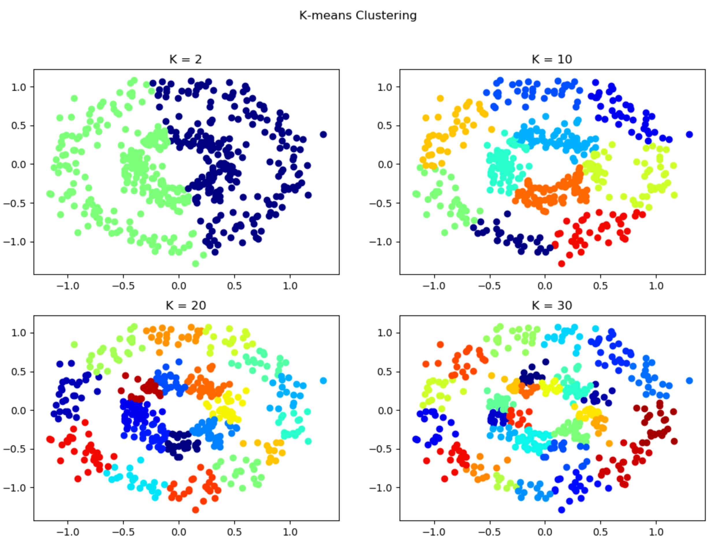
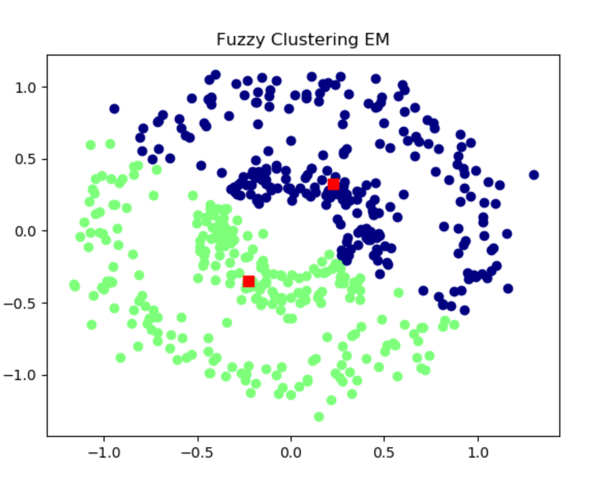
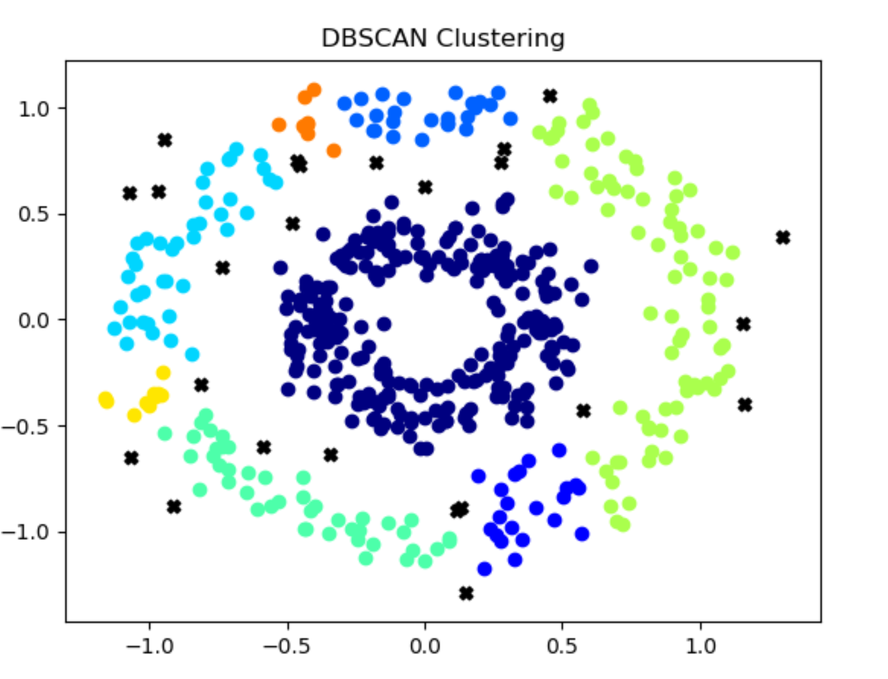

# Clustering-Practice

> In this assignment, three clustering models are implemented to cluster a set of points. After loading the data, we have: 
> data: a collection of 2-d points with the shape of (500, 2)

### K-means:
* Running time for different k-candidates (Exclude loading data): 
```
When k = 2, the running time is: 0.017952 seconds
When k = 10, the running time is: 0.117700 seconds
When k = 20, the running time is: 0.204453 seconds
When k = 30, the running time is: 0.191446 seconds
```

* Clustering Visualization (Using matplot): 


<br>

### Fuzzy Clustering EM
* It converges after 259 iterations. 
```
When iter=259:
The sum of SSE:  135.47485530600602
The centroids:  [[0.22807863464105096, 0.3290470455873491], [-0.22568437902811661, -0.3514806337389671]]
```
<br>

* Running Time (Exclude loading data): 
```
The running time is: 1.934826 seconds
```

<br>

* Clustering Visualization (Using matplot): 

> Notes: Red squares are centroids. 

<br>

### DBSCAN:

* Running Time (Exclude loading the data):
```
The running time is: 0.008951 seconds
```
<br>

* Clustering Visualization (Using matplot): 

> Notes: Black “X” are outliers.
